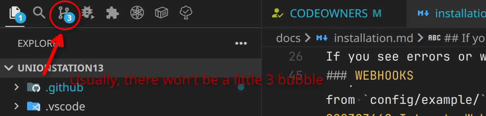
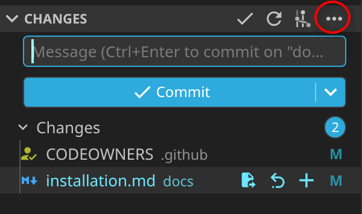
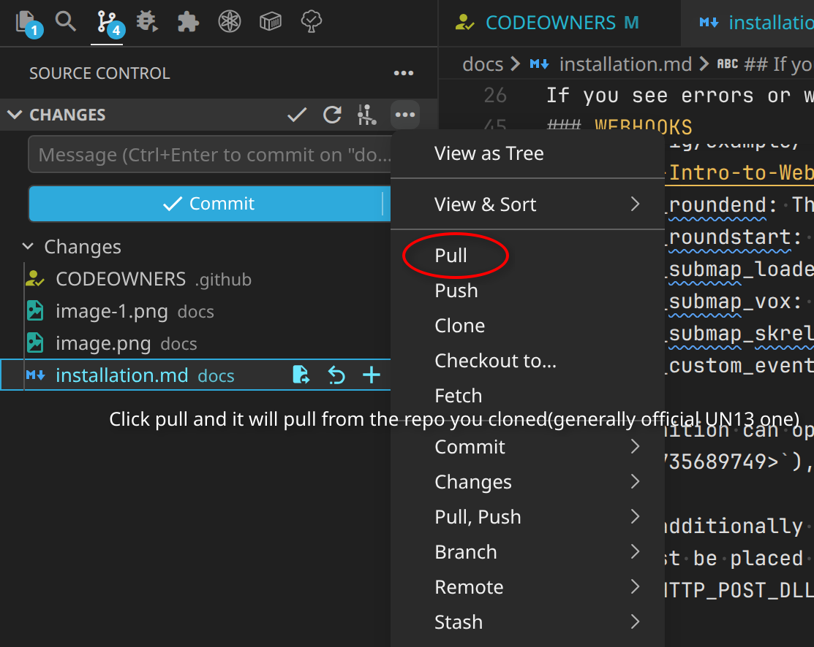

### DEFAULT INSTALLATION

**FOR THOSE WANTING TO SETUP A LONG-TERM SERVER, SEE [ADVANCED CONFIG](#sqladvanced-setup)**

It is highly recommended to **not use** the github zip feature if you'd like ease of updating, as it requires manually copying + pasting and is not documented here.

To do so, you'll need to download git or some client from [here](http://git-scm.com/). Once that is open, go to the folder where you want your code to be, right click, and click on "Git Bash". A terminal window will *likely* open, so when it does, input:

    git clone https://github.com/Unionstation-13/Unionstation13.git

Then, use your preferred editor to open the folder and **voila**, the server is installed.
#### COMPILING

First-time installation should be fairly straightforward. First, you'll need BYOND installed. You can get it from [here](http://www.byond.com/).

This is a source-only release, so the next step is to compile the server files. Open `baystation12.dme` by double-clicking it, open the Build menu, and click compile. This will take a little while, and if everything's done right you'll get a message like this:

    saving baystation12.dmb (DEBUG mode)
    baystation12.dmb - 0 errors, 0 warnings

If you see errors or warnings, post on the discord.
---

### CONFIGURATION

Copy the contents of the `/config/examples` folder into `/config`. You will now work with everthing contained within `/config`.

Edit `config.txt` to set the probabilities for different gamemodes in Secret and to set your server location so that all your players don't get disconnected at the end of each round. It's recommended you don't turn on the gamemodes with probability 0, as they have various issues and aren't currently being tested, they may have unknown and bizarre bugs.

Edit `admins.txt` to remove the default admins and add your own. "Game Master" is the highest level of access, and the other recommended admin levels for now are "Game Admin" and "Moderator". The format is:

    byondkey - Rank

where the BYOND key must be in lowercase and the admin rank must be properly capitalised. There are a bunch more admin ranks, but these two should be enough for most servers, assuming you have trustworthy admins.

To start the server, run Dream Daemon and enter the path to your compiled `baystation12.dmb` file. Make sure to set the port to the one you specified in the `config.txt`, and set the Security box to 'Trusted' so you don't have to confirm access to every single configuration and storage file for the server. Then press GO and the server should start up and be ready to join.

---

### WEBHOOKS

If you wish to use Discord webhooks, which are a way of passing information from the server to a Discord channel, you will need to copy `webhooks.json` into `config/` from `config/example/` and add definitions pointing the desired event at the desired [Discord webhook URL](https://support.discordapp.com/hc/en-us/articles/228383668-Intro-to-Webhooks). Valid webhook IDs as of time of writing are as follows:
- webhook_roundend: The round has ended. Will include the mode name and summarize survivors and ghosts.
- webhook_roundstart: The master controller has finished initializing and the round will begin soon.
- webhook_submap_loaded: A submap has been loaded and placed, and is available for people to join. Includes the name of the submap.
- webhook_submap_vox: The vox submap specifically has been loaded and placed. This is distinct for the purposes of tagging vox players with a @mention.
- webhook_submap_skrell: The Skrell submap specifically has been loaded and placed. This is distinct for the purposes of tagging Skrell players with a @mention.
- webhook_custom_event: The custom event text for the round has been set or changed.

Each definition can optionally include an array of roles to mention when the webhook is called. Roles must be provided using the role ID (ex. `<@&555231866735689749>`), which can be obtained by writing `\@somerole` into the chat, in order for pinging to work correctly.

Webhooks additionally require a HTTP POST library called [byhttp](https://github.com/Lohikar/byhttp). The compiled lib, `byhttp.dll` on Windows or `libbyhttp.so` on Linux, must be placed in the lib directory by default in order for webhooks to function. The DLL location can be customized by supplying `WINDOWS_HTTP_POST_DLL_LOCATION` `UNIX_HTTP_POST_DLL_LOCATION`, or `HTTP_POST_DLL_LOCATION` as preprocessor macros containing the desired path.

---

### UPDATING

Updating is dependant on whether you are working with a [docker](#sqladvanced-setup) install or a [default](#default-installation) install.

#### Default

Please first backup /config and /data. Then, run:
    git pull

In the root directory and it **should** update.
#### Docker
Simply run:

    git pull

#### Pulling git for VSCode users(NO CLI NEEDED)

To update an existing installation, first back up your `/config` and `/data` folders
as these store your server configuration, player preferences and banlist.

If you used the zip method, you'll need to download the zip file again and unzip it somewhere else, and then copy the `/config` and `/data` folders over.

If you used the git method, you simply need to type this in to git bash:

    git pull

When this completes, copy over your `/data` and `/config` folders again, just in case.

When you have done this, you'll need to recompile the code, but then it should work fine.

---

### SQL/Advanced Setup

Although there are fallbacks, Unionstation13 is intended to be run with a MySQL or MariaDB database when hosting.
If you fill out a .env with the following types:
- DB_ROOT_PASSWORD
- DB_PASSWORD
- DB_NAME
- DB_PATH
And have docker installed from [here](https://www.docker.com/), then all you do is run docker-compose up -d, and the server **should** start with a database. However, this is **not** required and should be used for dedicated server setups rather than just one-off hostings as it is more complex. 

#### Play-it Setup

If you wish to play with players outside of LAN, make sure to follow this step.

##### Creating a Play-it account
To create a playit.gg account, go to [playit.gg](playit.gg) and follow the instructions to create an account.

##### Connecting the Agent
In the wizard, select docker and it will give you a yml command like:

    version: '3'

    services:
    playit:
        image: ghcr.io/playit-cloud/playit-agent:0.17
        network_mode: host
        environment:
        - SECRET_KEY=mykeyhere

Grab the key and paste it into the .env as PLAYIT_KEY.

i.e:
    PLAYIT_KEY=ususuaus

Then, start your docker server with docker compose up -d and it should connect.

##### Connecting a Tunnel
This is the home stretch!
Click exit wizard in the top right of the screen and it will bring you to a screen where it says create new tunnel. Click there, type your tunnel's name, choose Minecraft Java(to get free TCP) as tunnel type, port count 1 and fill out the rest up as appropriate until you reach origin config.

For that, put in these values:
- IP: 127.0.0.1
- PORT: 8000
- PROXY PROTOCOL: NONE

Then create it, copy the address, add byond:// before it, and it might work.

Feel free to ask questions in the official Unionstation13 Discord:
https://discord.gg/Yj8a3v583j
